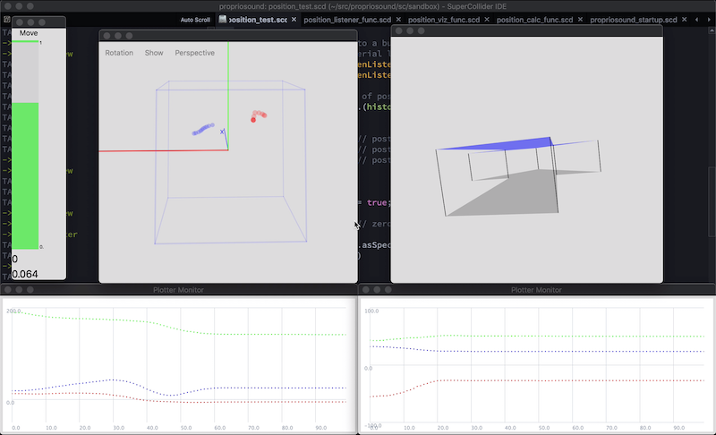
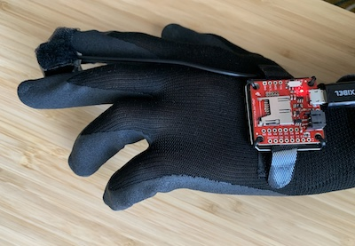
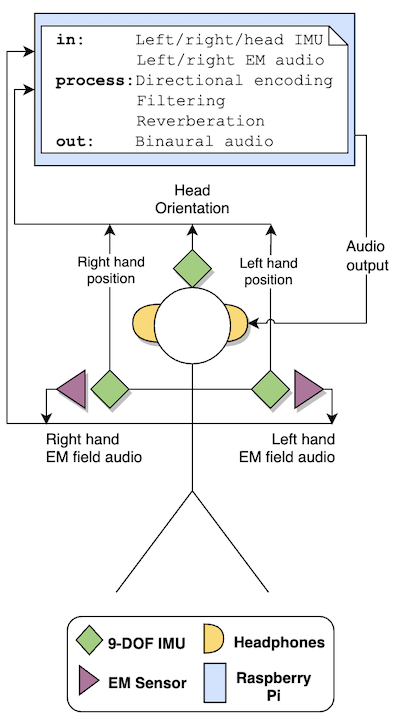

# Propriosound

Propriosound is a sensory augmentation framework for spatial auralization of "parasensory" phenomena. Using spatially aware sensors, electromagnetic (or other imperceptible) fields are converted into sound and encoded in a virtual binaural auditory scene. Parasensory probes are mounted to the hands, which are in turn tracked via IMUs, encoded into ambisonic spatial audio, and the scene presented to the listener via head-tracked binaural decoding over headphones.

This repository contains code for sensor IO and signal processing in SuperCollider, authored for this project (see the `sc` directory).

Various other utilities are required, such as modified IMU firmware for [head orientation tracking](https://github.com/mtmccrea/razor-9dof-ahrs/tree/v1.5.7.1-ptrbrtz-PR-mtm) (which also contains compass calibration routines and files) and [position tracking and the tap-to-reset feature](https://github.com/mtmccrea/9DOF_Razor_IMU/tree/initial-testing), using the in-built DMP of the IMU.

Other resources that informed the prototype:

- [Gait Tracking With x-IMU](https://github.com/xioTechnologies/Gait-Tracking-With-x-IMU/tree/master/Gait%20Tracking%20With%20x-IMU)
- [Calibration procedure](https://github.com/Razor-AHRS/razor-9dof-ahrs/wiki/Tutorial#sensor-calibration)

System visualization tools from within SuperCollider:

Hand-tracked EM sensing:

<!--  -->

Basic system diagram:

<!--  -->
